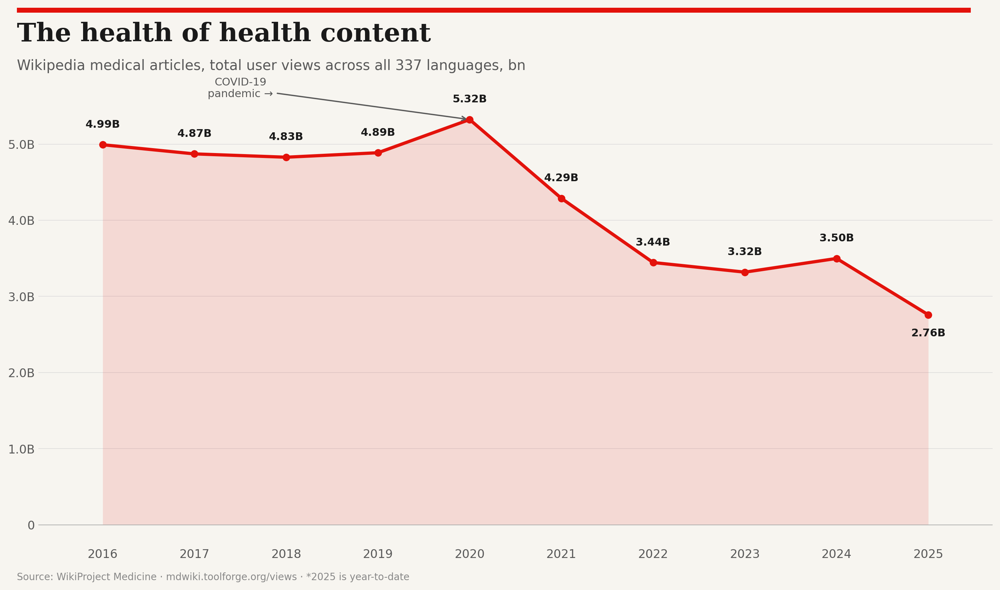

# Wikipedia Medical Article Pageviews — All Languages (2016–2025)

Economist-style visualisations of user pageviews for Wikipedia medical articles across **337 languages**, sourced from [WikiProject Medicine](https://mdwiki.toolforge.org/views/?sub_dir=users-agents).



## Charts

### Small multiples — all 337 languages (14 pages)

Every language Wikipedia with medical content, ranked by total views, 25 per page.

| Page | Ranks | Page | Ranks |
|------|-------|------|-------|
| [Page 1](charts/econ_all_langs_page_01.png) | #1–25 | [Page 8](charts/econ_all_langs_page_08.png) | #176–200 |
| [Page 2](charts/econ_all_langs_page_02.png) | #26–50 | [Page 9](charts/econ_all_langs_page_09.png) | #201–225 |
| [Page 3](charts/econ_all_langs_page_03.png) | #51–75 | [Page 10](charts/econ_all_langs_page_10.png) | #226–250 |
| [Page 4](charts/econ_all_langs_page_04.png) | #76–100 | [Page 11](charts/econ_all_langs_page_11.png) | #251–275 |
| [Page 5](charts/econ_all_langs_page_05.png) | #101–125 | [Page 12](charts/econ_all_langs_page_12.png) | #276–300 |
| [Page 6](charts/econ_all_langs_page_06.png) | #126–150 | [Page 13](charts/econ_all_langs_page_13.png) | #301–325 |
| [Page 7](charts/econ_all_langs_page_07.png) | #151–175 | [Page 14](charts/econ_all_langs_page_14.png) | #326–337 |

### Combined line charts

| Chart | Description |
|-------|-------------|
| [Top 15 combined](charts/econ_top15_combined.png) | All top 15 languages on one chart |
| [Top 14 (excl. English)](charts/econ_top14_no_english.png) | Rescaled without English for better visibility |
| [Growth champions](charts/econ_growth_champions.png) | Fastest-growing languages 2016–2024 (min 100K baseline) |
| [Global trend](charts/econ_global_trend.png) | Combined views across all 337 languages |

## Key findings

- **Global peak in 2020** — 5.3 billion views, driven by the COVID-19 pandemic
- **Steady decline since** — down to 3.5B in 2024 (likely due to AI-powered search reducing clickthrough)
- **English dominates** — 18.5B total views (44% of all traffic) across 53,901 articles
- **Growth stories** — Uzbek (+2,736%), Bengali (+783%), Armenian (+728%) saw explosive growth
- **Resilient languages** — Persian, Chinese, Korean, Hindi showed sustained growth against the global decline

## Data

- **Source**: [mdwiki.toolforge.org/views](https://mdwiki.toolforge.org/views/?sub_dir=users-agents) (WikiProject Medicine)
- **Metric**: User-agent pageviews (excludes bots/spiders)
- **Period**: 2016–2025 (2025 is year-to-date)
- **Coverage**: 337 language editions, 385,436 total articles
- **Total views**: 42.2 billion across the full period

Raw data is in [`data/data.json`](data/data.json).

## Reproducing the charts

### Requirements

```
pip install matplotlib
```

### Scripts

| Script | Output |
|--------|--------|
| `scripts/econ_all_langs.py` | 14-page small multiples (all 337 languages) |
| `scripts/econ_charts.py` | Overview charts (global trend, top 15, growth champions) |

Both scripts read from `data/data.json` (update the path in the script if needed).

```bash
cd scripts
python econ_all_langs.py
python econ_charts.py
```

## Design

Charts follow *The Economist*'s visual style:

- Warm off-white background (`#F7F5F0`)
- Signature red (`#E3120B`) as primary data colour
- Red rule at the top of each chart and panel
- Serif headlines, clean gridlines, minimal axis chrome
- End-labels on combined charts with automatic de-overlap
- Source attribution at the bottom

## License

Data sourced from Wikimedia projects (CC BY-SA). Charts and code in this repository are released under [CC BY-SA 4.0](https://creativecommons.org/licenses/by-sa/4.0/).

---

## Licence

This project is released into the public domain under the [CC0 1.0 Universal (CC0 1.0) Public Domain Dedication](https://creativecommons.org/publicdomain/zero/1.0/).

You can copy, modify, distribute and perform the work, even for commercial purposes, all without asking permission.
